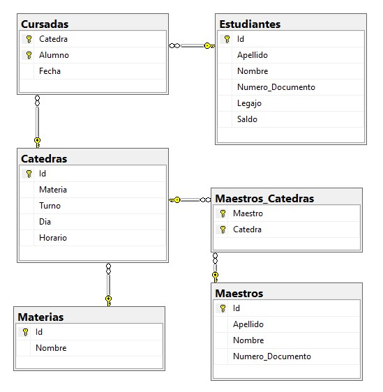

# administracion-educ

WebApp para administrar entidad educativa permitiendo realizar un listado de docentes, alumnos, asignaturas y cursadas en las que participa cada una de estas entidades.

## Base de datos

En el directorio `sql` se encuentran los scripts de creación de la base de datos, tablas y vistas. La estructura de la misma es similar a la siguiente:

